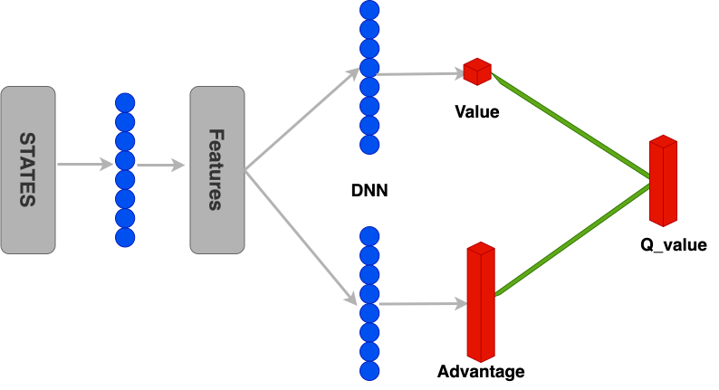

# AUV-optimal-path-searching
以悬崖困境为基础，构建三维网格地图环境，agent为自主式水下潜器(Autonomous Underwater Vehicle，简称AUV)。解决以下3个问题

## Q1 ：障碍物固定，出发、目的地固定，使用DRL方法训练agent到达目的地（40%）

## Q2 ：障碍物固定，出发、目的地任意，使用DRL方法训练agent到达目的地（40%）

## Q3 ：未知环境（障碍物所处位置不提前预知），agent观测视角有限，出发、目的地固定，使用DRL方法训练agent到达目的地（20%）

# Question 1
使用 DuelingNetwork + DDQN 实现对路径的最优规划，网络流程如下

