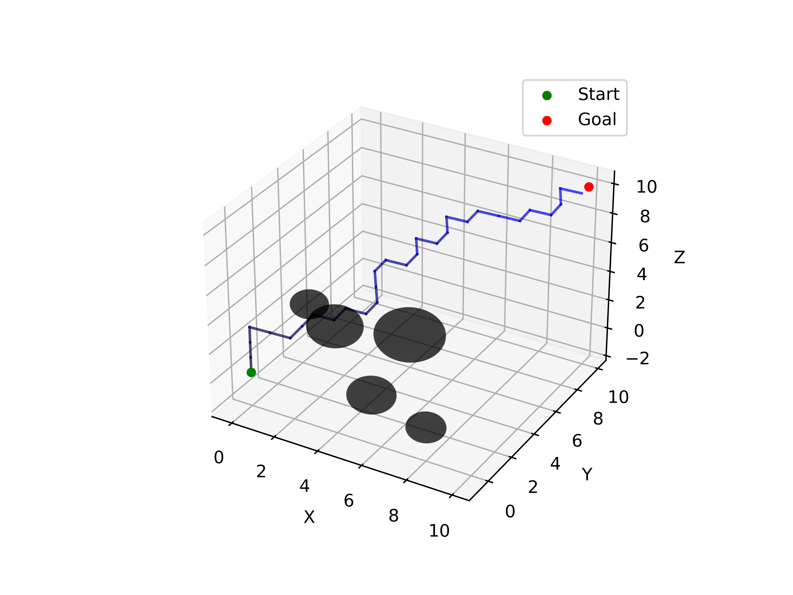
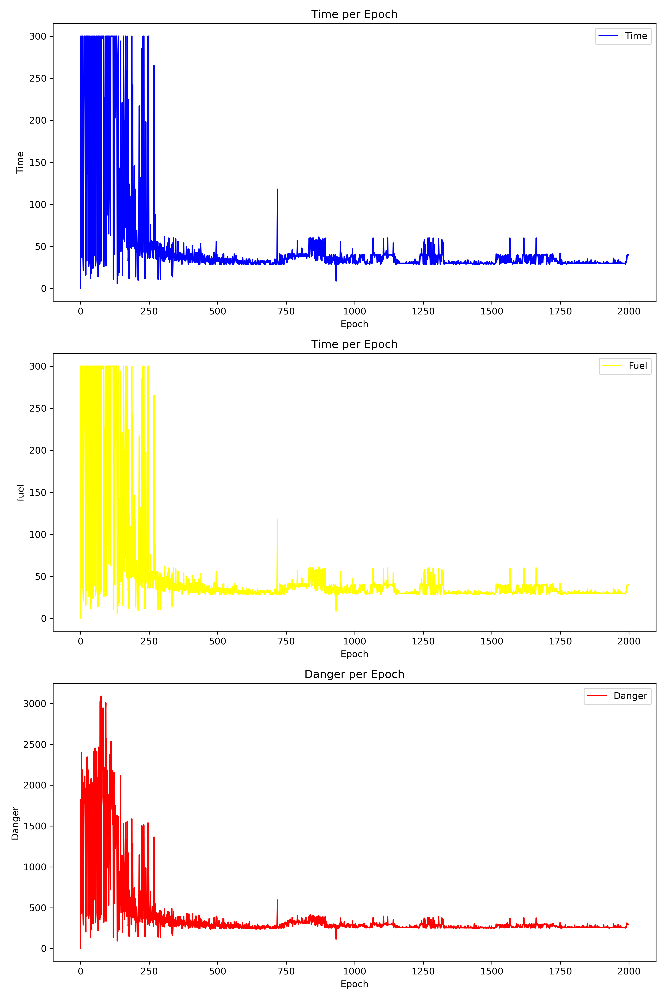
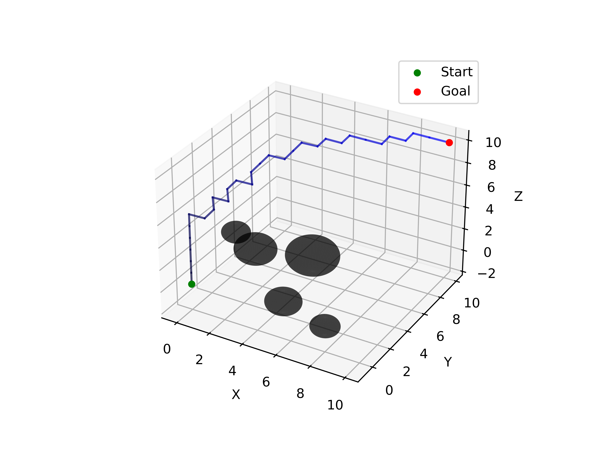
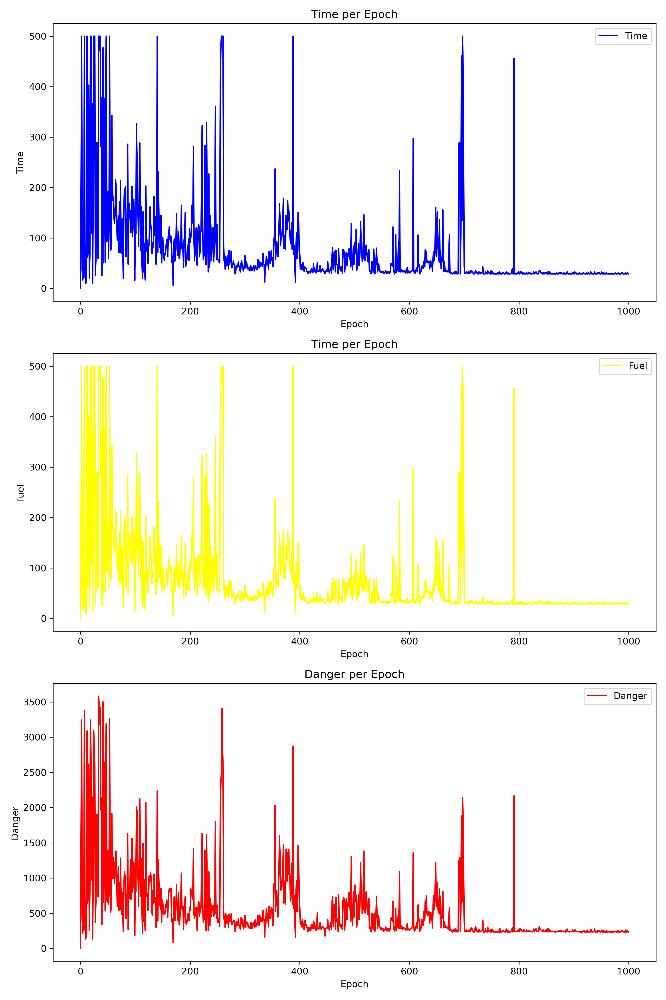

# AUV-optimal-path-searching
以悬崖困境为基础，构建三维网格地图环境，agent为自主式水下潜器(Autonomous Underwater Vehicle，简称AUV)。解决以下3个问题

 Q1 ：障碍物固定，出发、目的地固定，使用DRL方法训练agent到达目的地（40%）

 Q2 ：障碍物固定，出发、目的地任意，使用DRL方法训练agent到达目的地（40%）

 Q3 ：未知环境（障碍物所处位置不提前预知），agent观测视角有限，出发、目的地固定，使用DRL方法训练agent到达目的地（20%）

# Question 1
使用 DuelingNetwork + DDQN 实现对路径的最优规划，网络流程如下

训练了 1500 个epoch后收敛，训练结果图如下所示

# Question 2
依旧是使用了和 Question 1 类似的网络，但是修改Env 的 reset 函数，每次reset时随机初始化起点和终点，并且在state中添加起点和终点，最终训练的结果演示如下

# Question 3
由于本题增加了限制条件“视野范围受限”，所以我们在state中传入agent视野范围（假设为3）内的信息，这里我使用的“是否为障碍物”为信息传入
最终的训练结果和指标如下图

