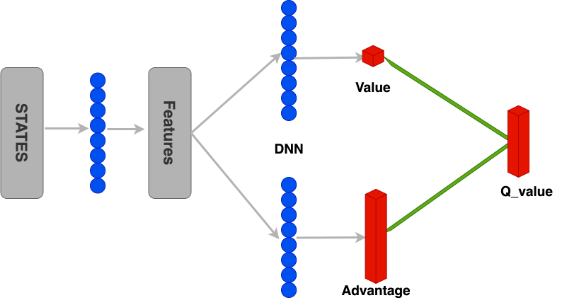
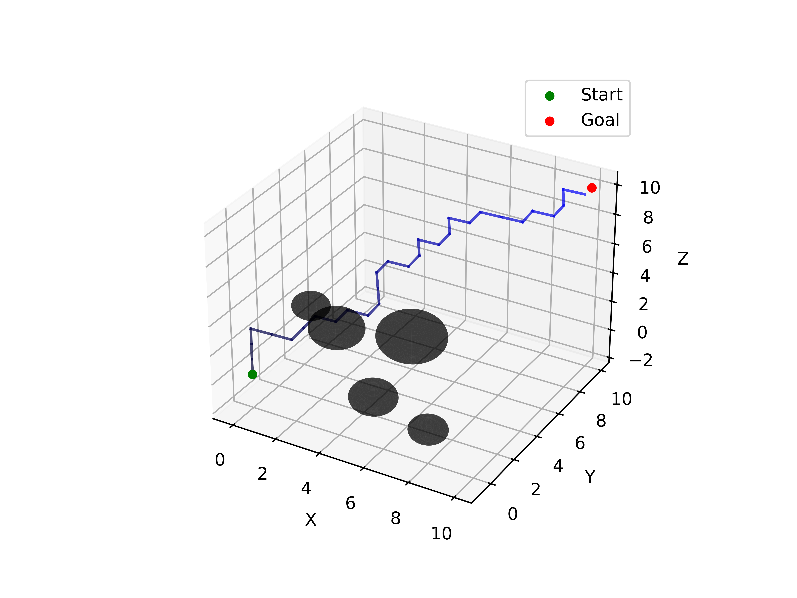
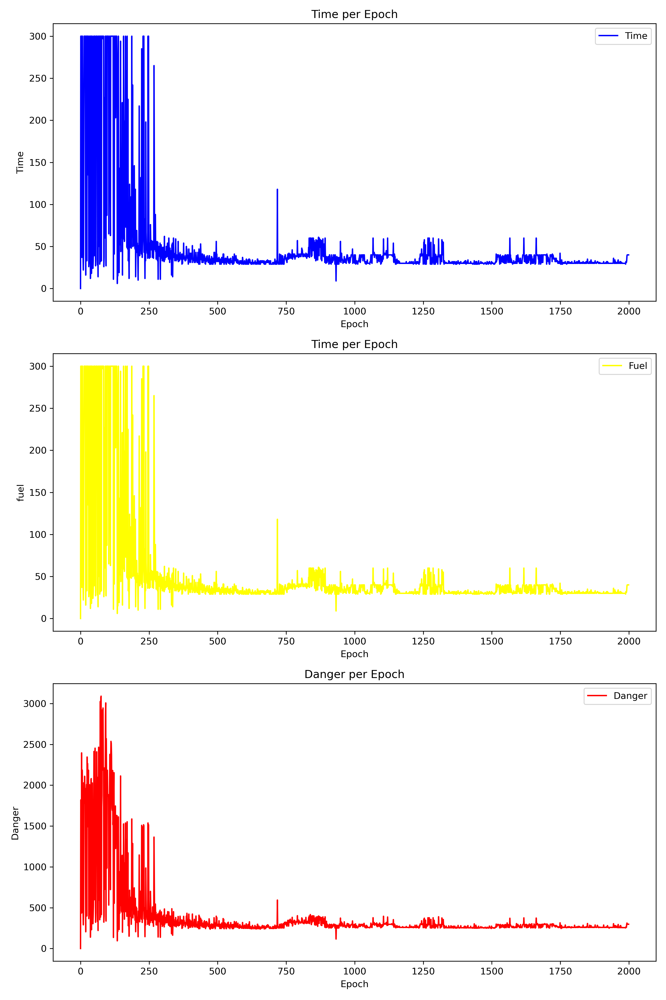
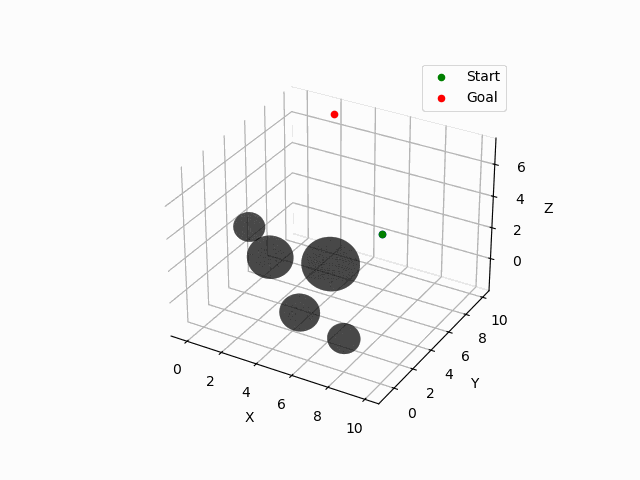
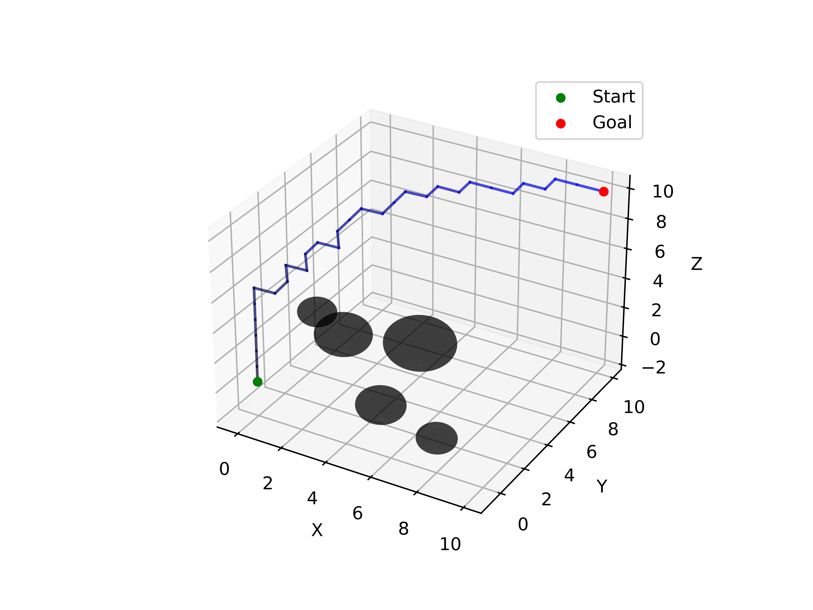
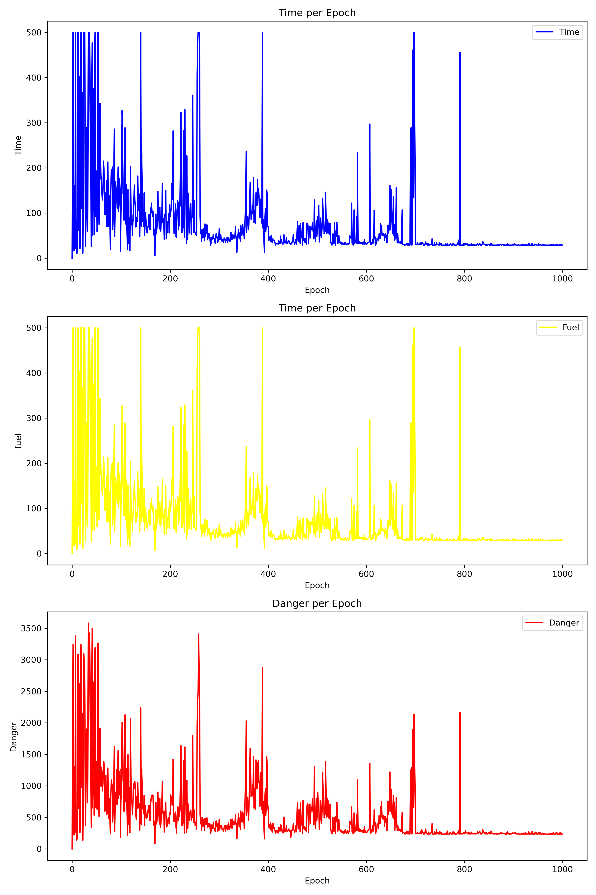

# AUV-optimal-path-searching

*English · [简体中文](README.zh-CN.md)*

Optimal path planning for an Autonomous Underwater Vehicle (AUV) with deep
reinforcement learning. The environment extends the classic Cliff Walking
problem into a three-dimensional grid map, where the agent is an AUV that must
reach a goal while avoiding obstacles and spending as little fuel and time as
possible.

Three tasks are addressed:

| Task | Setting | Weight |
| --- | --- | --- |
| **Q1** | Fixed obstacles, fixed start and destination | 40% |
| **Q2** | Fixed obstacles, arbitrary start and destination | 40% |
| **Q3** | Unknown environment (obstacle positions not known in advance), limited agent field of view, fixed start and destination | 20% |

## Environment

An 11×11×11 grid (coordinates 0–10 on each axis). By default the AUV starts at
`[0, 0, 0]` and the goal is `[10, 10, 10]`. Five spherical obstacles are placed
in the map, and a constant water current drifts the vehicle along the x and z
axes. Every step costs time and fuel; vertical moves (ascend / dive) cost extra
fuel.

Four environments are defined in [`env.py`](env.py), all following the Gym
`Env` interface:

| Class | Actions | Observation | Used for |
| --- | --- | --- | --- |
| `Auv_SimpleAction` | 6 (ascend, dive, forward, back, left, right) | 3 | Q1 |
| `Auv_changeable` | 6 | 9 (position + start + goal) | Q2 |
| `Auv_blined` | 6 | 30 (position + obstacle flags within a radius-3 view) | Q3 |
| `Auv_MultiActions` | 12 (adds steering angles; fuel cost grows with turn angle) | 3 | extended experiment |

## Method

All three tasks use a Dueling Network + DDQN agent, implemented in
[`policy.py`](policy.py). The network splits a shared feature layer into a value
stream and an advantage stream, with a separate target network and either a
uniform or a priority replay buffer.




## Usage

Select the environment and hyperparameters in [`main.py`](main.py), then run:

```bash
python main.py
```

The environment is chosen by the `env` assignment near the top of `main.py` —
`Auv_SimpleAction` for Q1, `Auv_changeable` for Q2, `Auv_blined` for Q3.
Training checkpoints are written to `result/`, and plots and animations to
`assets/`. Requires `torch`, `gym`, `numpy`, and `matplotlib`.

## Results

### Q1 — fixed start and destination

Converges after about 1500 epochs.





### Q2 — arbitrary start and destination

The same network as Q1. The environment's `reset` is modified to randomize the
start and goal on every episode, and both are appended to the state so the
policy can generalize across them.



### Q3 — limited field of view

Because the agent can only see part of the map, the state carries the
information within its field of view (radius 3) — here encoded as a per-cell
"is this an obstacle" flag.




